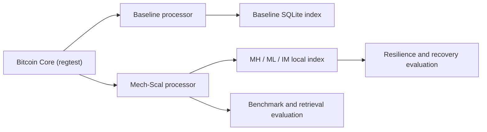

# Mech-Scal

Research prototype for output-aware replication and experimental indexing in UTXO blockchains.

Status: Research prototype - not production software.

## What this repository is

Mech-Scal is an external processing and indexing layer built on top of Bitcoin Core RPC. It does not modify Bitcoin Core source code. The current artifact was validated in regtest with a deliberately small and deterministic workload designed to make class transitions observable and reproducible.



## What the prototype demonstrates

- Deterministic workload generation over Bitcoin Core regtest.
- Baseline reconstruction of outputs and spends into a local SQLite index.
- Experimental layer-transition logic across MH, ML, and IM output classes.
- Repeated paired benchmark methodology for baseline versus Mech-Scal.
- IM-focused resilience experiments with replica placement, retrieval, and recovery.

## What it does not demonstrate

- Production-scale Bitcoin throughput.
- Preservation of throughput under real network load.
- Sublinear scalability proven in deployment.
- A real multi-node distributed storage deployment.
- Optimality of the logarithmic replication policy.

## Output classes

- `MH`: unspent outputs below the reduced prototype threshold.
- `ML`: unspent outputs at or above the reduced prototype threshold.
- `IM`: spent outputs retained as historical information.

The compact prototype uses `T_min = 24` only to trigger transitions in a short regtest workload. The historically analyzed operational boundary remains `2,016` blocks.

## Final experimental evidence

The repository now includes a bounded, processed evidence bundle for the final
experimental evaluation. It records the mainnet reconstruction frame through
block `870429`, storage-attribution sensitivity over 17,000 sampled
transactions and 46,962 original outputs, threshold sensitivity, the
50,000-consecutive-full-block stress scenario, and replication/storage
sensitivity.

The evaluated practical threshold pair is `T_min = 2,016` and
`T_max = 26,280`; these are experimental parameters, not a universal or
theoretically optimal choice. Method B in the attribution study is serialized
output bytes only, not measured physical storage.

Run the repository-local arithmetic audit with:

```bash
python3 scripts/verify_final_paper_results.py
```

See [`docs/final-experiment-audit.md`](docs/final-experiment-audit.md) and
[`results/final_paper/README.md`](results/final_paper/README.md) for the
artifact map, exact reported summaries, provenance boundaries, and known
limitations. Manuscript, LaTeX/Overleaf, submission, reviewer-response, and
publication-only artifacts are intentionally excluded.

## Reference results

Deterministic functional checks:

- 140 blocks
- 148 transactions
- 362 outputs
- 57 spends
- 5 same-block spends
- final MH = 50
- final ML = 255
- final IM = 57
- MH-to-ML = 266
- MH-to-IM = 46
- ML-to-IM = 11

Hardware-dependent benchmark references from the bundled local artifacts:

- median baseline processing time = 3.4474 s
- median Mech-Scal processing time = 3.8094 s
- median paired processing difference = 0.3863 s
- median baseline lookup = 0.0245 ms
- median Mech-Scal lookup = 0.027418 ms

Auxiliary local-index storage:

- baseline SQLite index = 401,408 bytes
- Mech-Scal SQLite index = 634,880 bytes
- absolute increase = 233,472 bytes

This SQLite increase is a local auxiliary-index cost. It is not the replicated blockchain storage of the network.

## Quick start

```bash
python3 -m venv .venv
source .venv/bin/activate
pip install -e .[figures,dev]
python3 -m unittest discover -s tests -v
```

If you plan to run the regtest orchestration scripts against a machine that already hosts Bitcoin Core mainnet, export the mainnet paths first:

```bash
export MECH_SCAL_MAINNET_DATADIR=/path/to/mainnet/datadir
export MECH_SCAL_MAINNET_BLOCKSDIR=/path/to/mainnet/blocksdir
```

## Reproduction paths

Quick validation:

- `python3 -m unittest discover -s tests -v`

Full paired benchmark:

- `bash scripts/run_phase6.sh`

Resilience evaluation:

- `bash scripts/run_phase7.sh`

See:

- [`docs/reproduction-guide.md`](docs/reproduction-guide.md)
- [`docs/experiment-protocol.md`](docs/experiment-protocol.md)
- [`docs/results-reference.md`](docs/results-reference.md)
- [`docs/artifact-scope.md`](docs/artifact-scope.md)

## Repository structure

- `src/`: core Python packages for workload generation, baseline processing, Mech-Scal, benchmarking, and resilience.
- `scripts/`: operational entrypoints and report generators.
- `tests/`: local logic and regression tests.
- `results/reference/phase6/`: paired benchmark reference artifacts.
- `results/reference/phase7/`: resilience reference artifacts.
- `results/figures/section_5_4/`: generated experimental figures for the local prototype evaluation.

## Extending the evaluation

This artifact is intentionally narrow. Researchers are invited to test:

- larger block ranges;
- higher output counts;
- other hardware architectures;
- different storage engines;
- real multi-node deployments;
- network latency and geographic distribution;
- broader fault and recovery models.

See [`docs/extending-the-evaluation.md`](docs/extending-the-evaluation.md).

## Contributing, citation, and security

- Contribution guide: [`CONTRIBUTING.md`](CONTRIBUTING.md)
- Citation metadata: [`CITATION.cff`](CITATION.cff)
- Security policy: [`SECURITY.md`](SECURITY.md)

## License

MIT. See [`LICENSE`](LICENSE).
